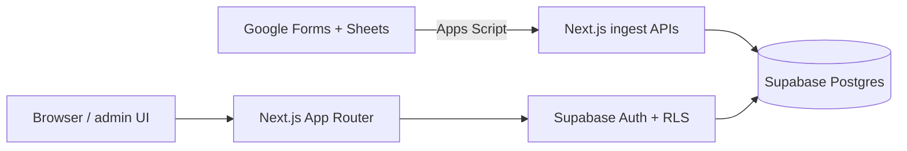
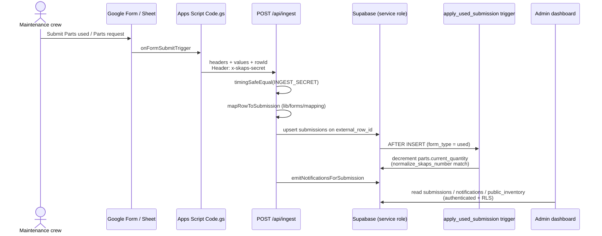

<div align="center">

# PartSync

**A production inventory dashboard that turns the SKAPS maintenance team's Google Forms into accurate shelf stock and an admin workflow.**


</div>


**Tech:** TypeScript · Next.js 15 · React 19 · Supabase (Postgres, Auth, RLS) · Google Apps Script · Tailwind · Vercel

---

## Overview

SKAPS' maintenance crew logs the parts they use and the parts they need through two bilingual Google Forms that all land in one spreadsheet. Keeping shelf counts accurate off that sheet is the hard part: it mixes both form types across ~48 columns, crews type the same part number a dozen different ways, and expense status is tracked by highlighting rows instead of filling in a field.

PartSync reads those rows, cleans them up, writes them to a real database, updates stock automatically, and gives admins a dashboard to work from. I built and shipped it solo as a freelance project, and the SKAPS team uses it daily.

## Features

**Crew keeps using the Google Forms they already know.** No new accounts, no retraining. The app handles the messy spreadsheet side behind the scenes.

**Shelf stock updates itself.** When a "parts used" row comes in, the quantity is decremented inside Postgres, so a retry or an app bug can't leave a count in a broken state.

**Messy input becomes clean records.** Bilingual headers and inconsistent part numbers get normalized before anything reaches the database. Anything that can't be matched gets flagged for review instead of silently disappearing.

**One place for admins to work.** Inventory, request pipeline, used log, repairs, notifications, and settings all live behind sign-in.

**Expense colors carry over.** Row highlight colors from the spreadsheet sync into the app, so nobody has to add a new form field.

## Tech Stack

| Layer | Technology | Notes |
| ----- | ---------- | ----- |
| App framework | [Next.js 15](https://nextjs.org/) (App Router) | Server Components, Route Handlers, Server Actions. |
| UI | [React 19](https://react.dev/) + [Tailwind CSS v4](https://tailwindcss.com/) + Radix/shadcn-style `components/ui` | Admin/public UI, forms, dialogs, charts chrome. |
| Language | [TypeScript](https://www.typescriptlang.org/) | Strict app + `lib/supabase/types.ts` for DB types. |
| Database / auth | [Supabase](https://supabase.com/) (Postgres, Auth, Storage, RLS) | Tables, triggers, RPCs, avatar bucket; cookie session via `@supabase/ssr`. |
| Charts | [Recharts](https://recharts.org/) | Dashboard usage widgets. |
| Drag-and-drop | [@dnd-kit](https://dndkit.com/) | Customizable admin dashboard grid layout. |
| Validation / forms | [Zod](https://zod.dev/) + [React Hook Form](https://react-hook-form.com/) | Admin CRUD forms. |
| Sheet bridge | [Google Apps Script](https://developers.google.com/apps-script) | Form ingest, row-color expense sync, master-list edits. |
| Hosting | [Vercel](https://vercel.com/) + [Supabase Cloud](https://supabase.com/) | Production app + database; `@vercel/analytics` in root layout. |

## Screenshots

**Admin dashboard** — configurable widget grid


**Parts used log** — expense status pulled from spreadsheet row colors


**Parts requests** — Requested → Ordered → Complete pipeline


**Inventory** — parts, quantities, and warehouse locations


## Architecture



## Engineering Decisions

**Mapping columns by header name, not position.** The responses sheet mixes two form types across roughly 48 columns, and those columns have shifted around as the sheet grew. Hard-coding column indexes would have meant ingest breaking every time someone rearranged something. Instead, `lib/forms/mapping.ts` recognizes bilingual headers and grabs the first populated column that matches, so the sheet can drift without taking sync down with it.

**Getting accurate stock out of inconsistent part numbers.** Crews will type the same part as `insert 164` one day and `INSERT_164` the next. Matching on the raw string alone would quietly miss stock updates. I put a shared `normalize_skaps_number` function in both Postgres and TypeScript, and moved stock changes into an `AFTER INSERT` trigger that floors quantity at zero. Part lookup then works in layers: exact match first, then an RPC, then a normalized scan, then fuzzy suggestions. Rows that still don't match get marked `needs_review` and raise a notification rather than failing silently.

**Per-user notification read state.** The first version used a single global `read_at` field, which meant one admin marking something read cleared it for everyone. I added a `notification_reads` junction table and an `unread_notification_count()` function so each admin keeps their own unread state.

## Results

- Replaced the manual spreadsheet reconciliation the maintenance team was doing by hand
- Running in production and used daily by SKAPS staff
- Tracks roughly 9,000 parts and over 10,000 form submissions to date

## What's Next

- Finish the Delivered / In transit admin UI. The `status`, `po_number`, and `received_at` fields already exist on `submissions`, so it's UI work rather than schema work.
- Tighten multi-role authorization. v1 treats any authenticated user as an admin for RLS purposes.
- Decide whether repair tracking should affect shelf quantity. Right now `parts_in_repair` is intentionally decoupled.

<details>
<summary><b>Technical deep dive</b></summary>

**Core mechanic:** Forms stay the source of truth for field entry; Google Apps Script POSTs to Next.js ingest routes; Supabase stores `parts` / `submissions` and applies stock changes.

### Ingest sequence



### Architecture notes

- **RLS is the authorization boundary.** anon cannot read `parts` / `public_inventory` after `0011_restrict_inventory_anon_access.sql`; middleware and `app/admin/layout.tsx` redirects are UX only.
- **Stock changes run in Postgres, not the API.** If quantity math ran in application code, a retried request or a bug could double-count or push stock negative. `trg_apply_used_submission` / `apply_used_submission()` floors quantity at zero and matches on `normalize_skaps_number`, making the database the single enforcer.
- **Ingest auth is a shared secret with constant-time compare.** `/api/ingest`, `/api/ingest-master`, and `/api/sync-expense-status` require `x-skaps-secret` vs `INGEST_SECRET` via `timingSafeEqual`; writes use the service-role client and bypass RLS.
- **Idempotent sheet sync.** submissions upsert on `external_row_id`; master-list variants upsert on their own `external_row_id`.
- **SKAPS resolution is layered.** exact match → `find_part_by_skaps_number` RPC → in-memory normalized scan → fuzzy suggestions; unmatched used rows get `status = needs_review` and an `unknown_skaps` notification.
- **Multi-warehouse locations without splitting stock identity.** shared fields on `parts`; warehouse/zone rows on `part_variants` (`0007_part_variants.sql`), synced from the Athens master sheet via `/api/ingest-master`.

### Route map

| Area | Routes |
| ---- | ------ |
| Public | `/`, `/forms`, `/inventory` (auth required), `/changelog` |
| Auth | `/login`; session refresh in `lib/supabase/middleware.ts`; admin invites from `/admin/settings` |
| Admin | `/admin` (widget grid), `/admin/notifications`, `/admin/used`, `/admin/requests`, `/admin/inventory`, `/admin/repair`, `/admin/audit`, `/admin/reports/yesterday`, `/admin/settings`, `/admin/changelog` |
| Ingest / sync | `POST /api/ingest`, `POST /api/ingest-master`, `POST /api/sync-expense-status` |
| Planned | `/admin/delivered` (placeholder; `status` / `po_number` / `received_at` already on `submissions`) |

### Project structure

```text
PartSync/
├── app/
│   ├── (public)/          # Home, /forms, /inventory, /changelog
│   ├── admin/             # Dashboard, logs, inventory, repair, settings, audit
│   ├── api/               # ingest, ingest-master, sync-expense-status
│   ├── auth/callback/     # Supabase auth callback
│   └── login/             # Admin sign-in
├── components/            # UI, dashboard widgets, nav, inventory, requests, repair
├── lib/
│   ├── forms/             # Header mapping, normalize, ingest notifications
│   ├── inventory/         # SKAPS match, stock helpers, master-list map
│   ├── supabase/          # Clients, env, types, fetch-all
│   ├── dashboard/         # Widget catalog + server widgets
│   ├── audit/             # Admin action logging
│   └── notifications/     # Read-state helpers
├── supabase/
│   ├── migrations/        # Schema, RLS, triggers, RPCs
│   └── seed/              # One-off bootstrap / import scripts used at launch
├── docs/apps-script/      # Bound Apps Script sources for the live sheets
└── middleware.ts          # Session refresh; protect /admin and /inventory
```

### Security

| Mechanism | Where |
| --------- | ----- |
| Supabase Auth (email/password) | `/login`, `app/login/actions.ts`, cookie session via `@supabase/ssr` |
| Route gate for `/admin/**` and `/inventory` | `lib/supabase/middleware.ts` + `app/admin/layout.tsx` `getUser()` |
| RLS on tables/views | `supabase/migrations/0002_rls.sql` and later migrations; anon SELECT revoked on inventory in `0011` |
| Service role only on trusted server paths | `createServiceClient()` in ingest routes, never from client components |
| Shared-secret header for Apps Script | `x-skaps-secret` vs `INGEST_SECRET` with `timingSafeEqual` |
| Profile self-update; broader profile read for audit/avatars | `profiles` policies in `0002` / `0016` |
| Append-only audit trail | `audit_log` insert-as-self, no update/delete policies (`0017`) |
| Avatar storage policies | `0018_avatars_storage.sql` |

</details>

<details>
<summary><b>Run it locally</b></summary>

### Prerequisites

- Node.js (compatible with Next.js 15)
- A [Supabase](https://supabase.com/) project with migrations from `supabase/migrations/` applied
- (Optional) Google Apps Script bound to the live sheets, see `docs/apps-script/SETUP.md`

### Setup

```bash
git clone https://github.com/ar1shah/PartSync.git
cd PartSync
cp .env.example .env.local   # fill in keys (names below)
npm install                  # or pnpm install
npm run dev                  # next dev --turbopack
```

### Required env var names

From `.env.example`:

- `NEXT_PUBLIC_SUPABASE_URL`
- `NEXT_PUBLIC_SUPABASE_ANON_KEY`
- `SUPABASE_SERVICE_ROLE_KEY`
- `INGEST_SECRET`
- `NEXT_PUBLIC_GFORM_USED_URL` (optional for local UI)
- `NEXT_PUBLIC_GFORM_REQUEST_URL` (optional for local UI)
- `NEXT_PUBLIC_SITE_URL` (optional locally; defaults example uses `http://localhost:3000`)

### Useful scripts

| Script | Command |
| ------ | ------- |
| `npm run dev` | Start Next.js with Turbopack |
| `npm run build` / `npm start` | Production build and serve |
| `npm run lint` | ESLint |
| `npm run typecheck` | `tsc --noEmit` |
| `npm run format` / `format:check` | Prettier |
| `npm run import:historical` | One-off historical import (`tsx supabase/seed/import_historical.ts`) |

</details>

---

Built for the SKAPS maintenance team and running in production. The live app is only accessible to SKAPS staff, so the demo above and the screenshots are the best look at it. This repo is public for portfolio context.

Ari Shah · [Portfolio](https://www.ar13.dev/)

MIT License, see [LICENSE](LICENSE).
