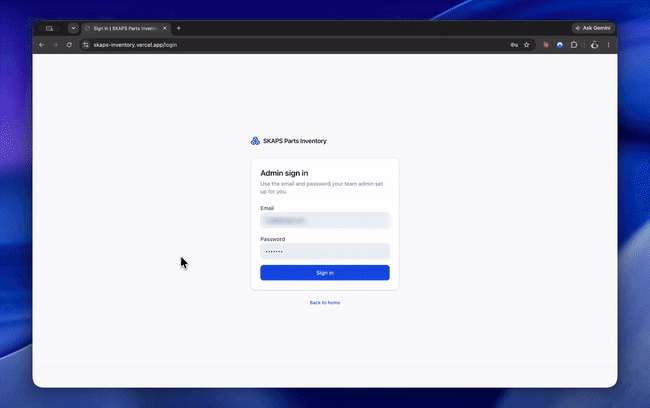
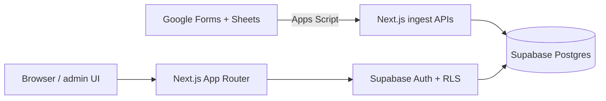
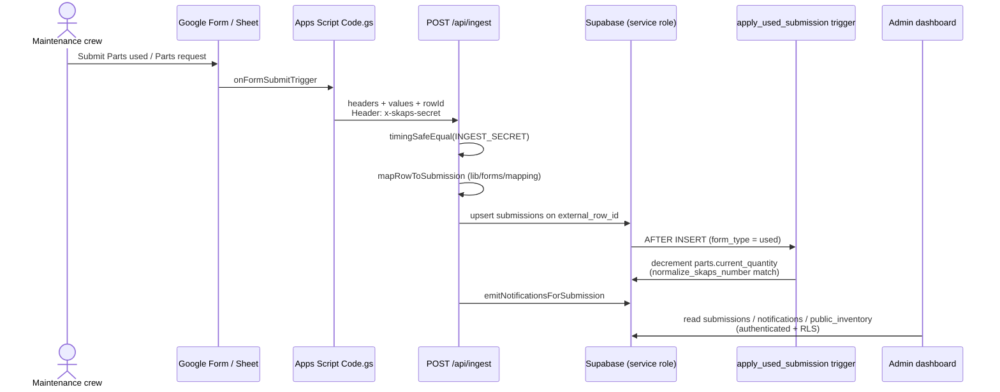
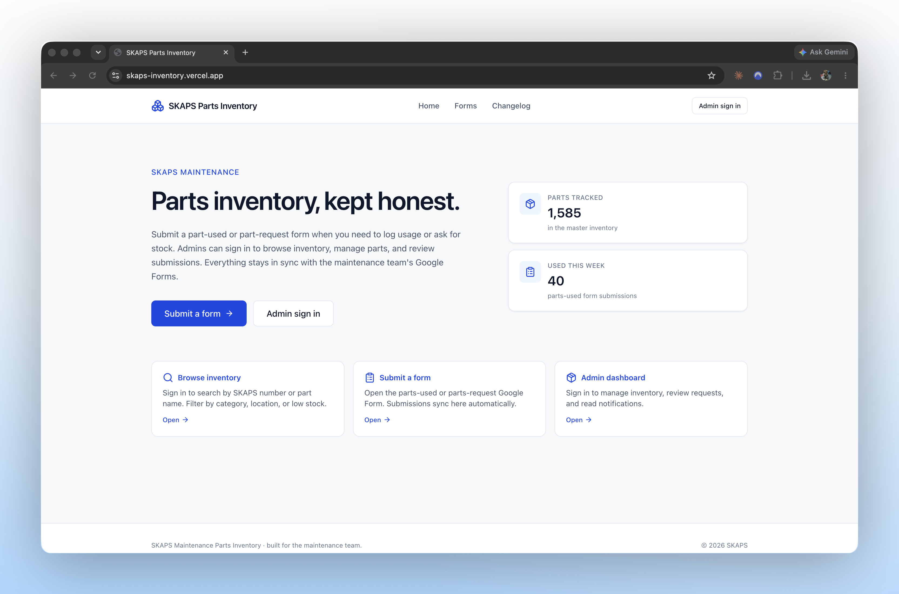
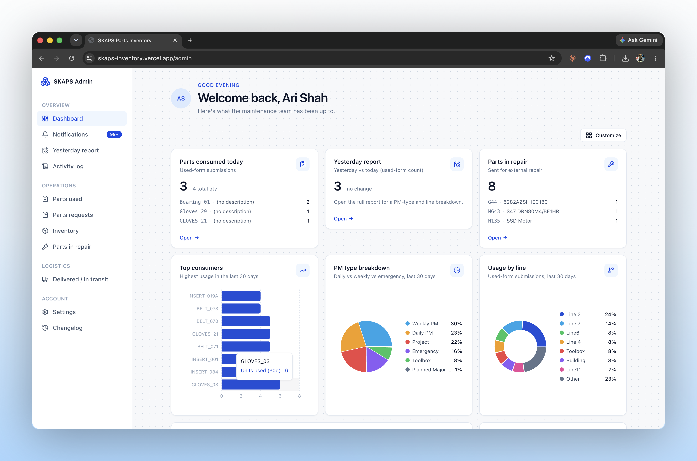
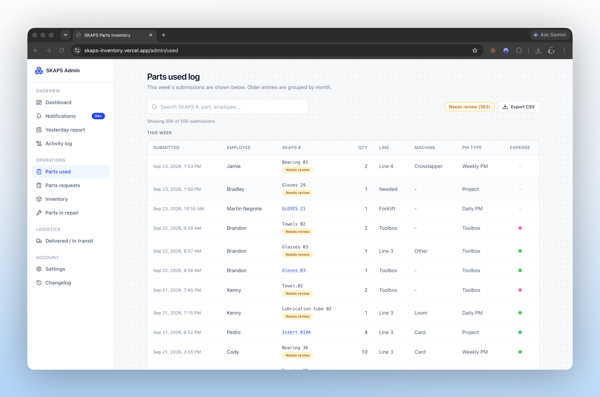
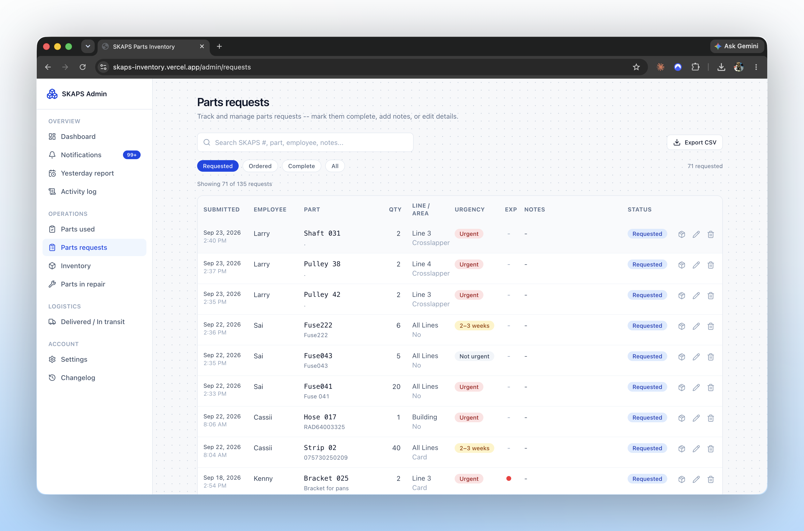
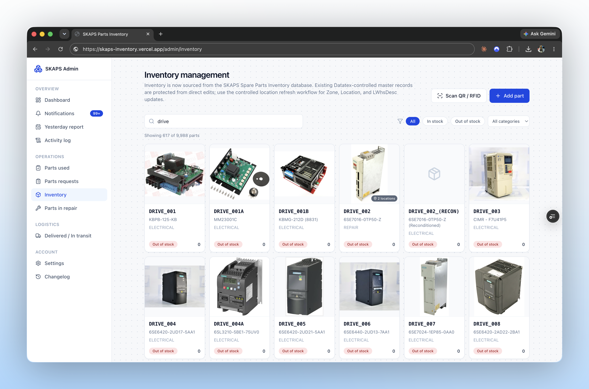

# PartSync

**A production inventory dashboard that turns the SKAPS maintenance team's Google Forms into accurate shelf stock and an admin workflow.**

**[Live Demo](https://skaps-inventory.vercel.app)**




**Tech:** TypeScript · Next.js 15 · React 19 · Supabase (Postgres + Auth) · Google Apps Script · Vercel

---

## Overview

Maintenance already logs parts used and parts requested through two bilingual Google Forms that land in one spreadsheet. The hard part is keeping shelf stock accurate when that sheet mixes two form types across many columns, part numbers are typed inconsistently, and expense status lives as row fill colors rather than form fields. PartSync ingests those rows, normalizes them into a database, updates stock automatically, and gives admins a signed-in dashboard to act on the results.

## Highlights

- **Keeps the crew on Google Forms** — field entry stays on the forms they already use; the app handles the messy spreadsheet side
- **Turns spreadsheet chaos into reliable records** — bilingual headers and inconsistent part numbers get normalized before they hit the database
- **Updates shelf stock automatically** — when a "parts used" row lands, quantity is decremented in Postgres so retries and app bugs cannot leave negative counts from that path
- **Gives admins one place to work** — inventory, request workflow, used log, repairs, notifications, and settings behind sign-in
- **Preserves spreadsheet expense colors** — row fill colors sync into the app so staff do not need new form fields for expense status


## My Role

Solo freelance project for SKAPS Industries. I owned the entire stack — database schema and RLS policies, the Next.js admin app, the Google Apps Script ingest bridge, and deployment — from initial build through ongoing maintenance in production.

## Architecture




## Engineering Decisions & Challenges

**Why header-hint mapping instead of column indexes:** The responses sheet mixes two form types across ~48 columns, and columns have moved as the sheet grew. Hard-coding indices would break ingest on every layout tweak. `lib/forms/mapping.ts` canonicalizes bilingual headers and picks the first populated matching column so sheet drift does not break sync.

**Hardest problem — inconsistent SKAPS numbers vs accurate stock:** Crews type the same part as `insert 164` or `INSERT_164`. Matching only on the raw string would miss stock updates. A shared `normalize_skaps_number` lives in Postgres (`0009_normalize_skaps_matching.sql`) and TypeScript; used-row stock changes run in an `AFTER INSERT` trigger that floors quantity at zero; the app resolves parts with exact match → RPC → normalized scan → fuzzy suggestions so unmatched rows go to `needs_review` instead of silently failing.

**Why per-user notification reads:** A single global `notifications.read_at` meant one admin marking a notice read cleared it for everyone. `0015_notification_reads.sql` introduced a `notification_reads` junction and `unread_notification_count()` so each admin keeps their own unread state.

## What's Next

- Finish the **Delivered / In transit** admin UI (`/admin/delivered` is still a placeholder; `status` / `po_number` / `received_at` already exist on `submissions`)
- Tighten multi-role authorization (v1 treats any authenticated user as an admin for RLS purposes)
- Decide whether repair tracking should affect shelf quantity (today `parts_in_repair` is intentionally decoupled)

**Technical deep dive**

### Roles


| Role             | What they do                                                                                                                     |
| ---------------- | -------------------------------------------------------------------------------------------------------------------------------- |
| Maintenance crew | Submit **Parts used** / **Parts request** via the existing Google Forms (linked from `/forms`). They do not need an app account. |
| Admin            | Sign in at `/login`, browse inventory, process request/used logs, handle repairs, notifications, settings, and invites.          |


**Core mechanic:** Forms stay the source of truth for field entry; Google Apps Script POSTs to Next.js ingest routes; Supabase stores `parts` / `submissions` and applies stock changes.

### Ingest sequence




### Architecture notes

- **RLS is the authorization boundary** — anon cannot read `parts` / `public_inventory` after `0011_restrict_inventory_anon_access.sql`; middleware and `app/admin/layout.tsx` redirects are UX only.
- **Stock changes run in Postgres** — `trg_apply_used_submission` / `apply_used_submission()` floors quantity at zero and matches on `normalize_skaps_number`.
- **Ingest auth is a shared secret with constant-time compare** — `/api/ingest`, `/api/ingest-master`, and `/api/sync-expense-status` require `x-skaps-secret` vs `INGEST_SECRET` via `timingSafeEqual`; writes use the service-role client and bypass RLS.
- **Idempotent sheet sync** — submissions upsert on `external_row_id`; master-list variants upsert on their own `external_row_id`.
- **SKAPS resolution is layered** — exact match → `find_part_by_skaps_number` RPC → in-memory normalized scan → fuzzy suggestions; unmatched used rows get `status = needs_review` and an `unknown_skaps` notification.
- **Multi-warehouse locations without splitting stock identity** — shared fields on `parts`; warehouse/zone rows on `part_variants` (`0007_part_variants.sql`), synced from the Athens master sheet via `/api/ingest-master`.


### Tech stack


| Layer              | Technology                                                                                                        | Notes                                                                      |
| ------------------ | ----------------------------------------------------------------------------------------------------------------- | -------------------------------------------------------------------------- |
| App framework      | [Next.js 15](https://nextjs.org/) (App Router)                                                                    | Server Components, Route Handlers, Server Actions.                         |
| UI                 | [React 19](https://react.dev/) + [Tailwind CSS v4](https://tailwindcss.com/) + Radix/shadcn-style `components/ui` | Admin/public UI, forms, dialogs, charts chrome.                            |
| Language           | [TypeScript](https://www.typescriptlang.org/)                                                                     | Strict app + `lib/supabase/types.ts` for DB types.                         |
| Database / auth    | [Supabase](https://supabase.com/) (Postgres, Auth, Storage, RLS)                                                  | Tables, triggers, RPCs, avatar bucket; cookie session via `@supabase/ssr`. |
| Charts             | [Recharts](https://recharts.org/)                                                                                 | Dashboard usage widgets.                                                   |
| Drag-and-drop      | [@dnd-kit](https://dndkit.com/)                                                                                   | Customizable admin dashboard grid layout.                                  |
| Validation / forms | [Zod](https://zod.dev/) + [React Hook Form](https://react-hook-form.com/)                                         | Admin CRUD forms.                                                          |
| Sheet bridge       | [Google Apps Script](https://developers.google.com/apps-script)                                                   | Form ingest, row-color expense sync, master-list edits.                    |
| Hosting            | [Vercel](https://vercel.com/) + [Supabase Cloud](https://supabase.com/)                                           | Production app + database; `@vercel/analytics` in root layout.             |


### Core features


#### Public (unauthenticated)

- Home (`/`), forms hub (`/forms`), public changelog (`/changelog`)
- Links out to the live Google Forms the crew already uses


#### Auth

- Email/password sign-in (`/login`)
- Session refresh in `lib/supabase/middleware.ts`; `/admin/**` and `/inventory` require a user
- Additional admins invited from `/admin/settings`


#### Admin operations

- **Dashboard** (`/admin`) — configurable widget grid; only placed widgets load data
- **Notifications** (`/admin/notifications`) — per-user read/unread
- **Yesterday report** (`/admin/reports/yesterday`)
- **Activity log** (`/admin/audit`) — append-only `audit_log` for admin actions
- **Parts used** (`/admin/used`) — used submissions, expense-status dots from sheet colors
- **Parts requests** (`/admin/requests`) — Requested → Ordered → Complete workflow on `submissions.status`
- **Inventory** (`/admin/inventory`) — CRUD on `parts` / variants; browse also at `/inventory` (auth required)
- **Parts in repair** (`/admin/repair`) — `parts_in_repair` tracker (decoupled from shelf qty)
- **Settings** — profile, avatar, appearance, password, invite admin
- **Changelog** (`/admin/changelog`)


#### Ingest / sync (server)

- `POST /api/ingest` — form rows → `submissions` + notifications
- `POST /api/ingest-master` — Athens master sheet rows → `parts` + `part_variants`
- `POST /api/sync-expense-status` — sheet row colors → `submissions.expense_status`


#### Planned / deferred

- **Delivered / In transit** (`/admin/delivered`) — UI placeholder; `status` / `po_number` / `received_at` already exist on `submissions`


### Project structure

```text
skaps-inventory/
├── app/
│   ├── (public)/          # Home, /forms, /inventory, /changelog
│   ├── admin/             # Dashboard, logs, inventory, repair, settings, audit
│   ├── api/               # ingest, ingest-master, sync-expense-status
│   ├── auth/callback/     # Supabase auth callback
│   └── login/             # Admin sign-in
├── components/            # UI, dashboard widgets, nav, inventory, requests, repair
├── lib/
│   ├── forms/             # Header mapping, normalize, ingest notifications
│   ├── inventory/         # SKAPS match, stock helpers, master-list map
│   ├── supabase/          # Clients, env, types, fetch-all
│   ├── dashboard/         # Widget catalog + server widgets
│   ├── audit/             # Admin action logging
│   └── notifications/     # Read-state helpers
├── supabase/
│   ├── migrations/        # Schema, RLS, triggers, RPCs
│   └── seed/              # One-off bootstrap / import scripts used at launch
├── docs/apps-script/      # Bound Apps Script sources for the live sheets
└── middleware.ts          # Session refresh; protect /admin and /inventory
```


### Security


| Mechanism                                                   | Where                                                                                               |
| ----------------------------------------------------------- | --------------------------------------------------------------------------------------------------- |
| Supabase Auth (email/password)                              | `/login`, `app/login/actions.ts`, cookie session via `@supabase/ssr`                                |
| Route gate for `/admin/**` and `/inventory`                 | `lib/supabase/middleware.ts` + `app/admin/layout.tsx` `getUser()`                                   |
| RLS on tables/views                                         | `supabase/migrations/0002_rls.sql` and later migrations; anon SELECT revoked on inventory in `0011` |
| Service role only on trusted server paths                   | `createServiceClient()` in ingest routes — never from client components                             |
| Shared-secret header for Apps Script                        | `x-skaps-secret` vs `INGEST_SECRET` with `timingSafeEqual`                                          |
| Profile self-update; broader profile read for audit/avatars | `profiles` policies in `0002` / `0016`                                                              |
| Append-only audit trail                                     | `audit_log` insert-as-self, no update/delete policies (`0017`)                                      |
| Avatar storage policies                                     | `0018_avatars_storage.sql`                                                                          |


### Migrations (high level)


| Migration                                 | Purpose                                                                                |
| ----------------------------------------- | -------------------------------------------------------------------------------------- |
| `0001_init.sql`                           | `parts`, `submissions`, `profiles`, `notifications`; stock trigger; `public_inventory` |
| `0002_rls.sql`                            | RLS baseline                                                                           |
| `0003_profile_autocreate.sql`             | Auto-create `profiles` on signup                                                       |
| `0005_parts_in_repair.sql`                | Repair tracker (decoupled from shelf qty)                                              |
| `0007_part_variants.sql`                  | Multi-warehouse location rows                                                          |
| `0009_normalize_skaps_matching.sql`       | Normalized SKAPS matching in stock trigger                                             |
| `0010_find_part_by_skaps_rpc.sql`         | Service-role RPC for part lookup                                                       |
| `0011_restrict_inventory_anon_access.sql` | Inventory auth-only                                                                    |
| `0013` / `0014`                           | `expense_status` from sheet colors                                                     |
| `0015_notification_reads.sql`             | Per-user notification read state                                                       |
| `0016_user_preferences.sql`               | Dashboard prefs + profile fields                                                       |
| `0017_audit_log.sql`                      | Append-only audit log                                                                  |
| `0018_avatars_storage.sql`                | Avatar storage bucket + policies                                                       |


### Project status


| Area                                                     | Status                     |
| -------------------------------------------------------- | -------------------------- |
| Public home / forms / changelog                          | Complete                   |
| Admin auth, dashboard widgets, settings, invites         | Complete                   |
| Parts used & parts request logs (incl. Ordered workflow) | Complete                   |
| Inventory CRUD + auth-gated `/inventory`                 | Complete                   |
| Google Form ingest + expense color sync                  | Complete                   |
| Master-list ingest + `part_variants`                     | Complete                   |
| Parts in repair                                          | Complete                   |
| Per-user notifications + audit log + avatars             | Complete                   |
| Delivered / in-transit tracker UI                        | Planned (placeholder page) |


### Screenshots

















**Run it locally**

### Prerequisites

- Node.js (compatible with Next.js 15)
- A [Supabase](https://supabase.com/) project with migrations from `supabase/migrations/` applied
- (Optional) Google Apps Script bound to the live sheets — see `docs/apps-script/SETUP.md`


### Setup

```bash
git clone https://github.com/ar1shah/skaps-inventory.git
cd skaps-inventory
cp .env.example .env.local   # fill in keys (names below)
npm install                  # or pnpm install
npm run dev                  # next dev --turbopack
```


### Required env var names

From `.env.example`:

- `NEXT_PUBLIC_SUPABASE_URL`
- `NEXT_PUBLIC_SUPABASE_ANON_KEY`
- `SUPABASE_SERVICE_ROLE_KEY`
- `INGEST_SECRET`
- `NEXT_PUBLIC_GFORM_USED_URL` (optional for local UI)
- `NEXT_PUBLIC_GFORM_REQUEST_URL` (optional for local UI)
- `NEXT_PUBLIC_SITE_URL` (optional locally; defaults example uses `http://localhost:3000`)


### Useful scripts


| Script                            | Command                                                              |
| --------------------------------- | -------------------------------------------------------------------- |
| `npm run dev`                     | Start Next.js with Turbopack                                         |
| `npm run build` / `npm start`     | Production build and serve                                           |
| `npm run lint`                    | ESLint                                                               |
| `npm run typecheck`               | `tsc --noEmit`                                                       |
| `npm run format` / `format:check` | Prettier                                                             |
| `npm run import:historical`       | One-off historical import (`tsx supabase/seed/import_historical.ts`) |


### Tests

No automated `test` script is defined in `package.json`. Use `npm run lint` and `npm run typecheck` for local checks.


Built for the SKAPS maintenance team and used in production. The repo is public for portfolio context; the live system serves SKAPS staff only.

---

Ari Shah · [Portfolio](https://www.ar13.dev/) 

MIT License — see [LICENSE](LICENSE).