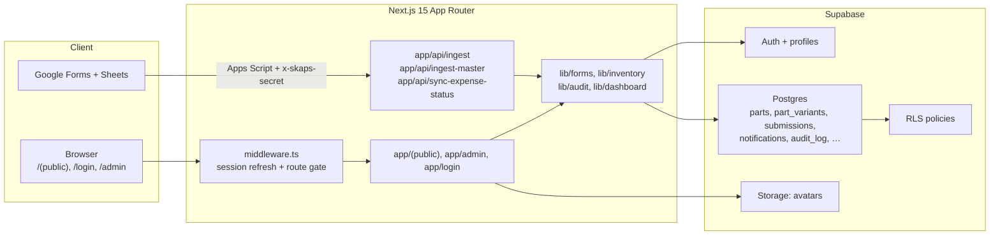
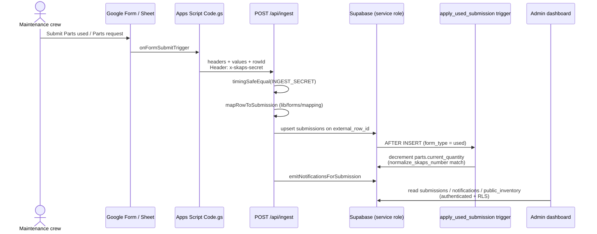

# SKAPS Parts Inventory

**A production inventory dashboard built for the SKAPS maintenance team.**

Internal tool for one company — not a product meant to be adopted elsewhere. The repo is public for portfolio context; the live system serves SKAPS staff only.

[](https://nextjs.org/)
[](https://www.typescriptlang.org/)
[](https://supabase.com/)
[](https://vercel.com/)

## Overview

**Live:** [https://skaps-inventory.vercel.app](https://skaps-inventory.vercel.app)

Maintenance already logs parts used and parts requested through two bilingual Google Forms that write into one spreadsheet. The hard part is not CRUD — it is keeping shelf stock accurate when the same sheet mixes two form types across ~48 columns, SKAPS numbers are typed inconsistently (`insert 164` vs `INSERT_164`), and expense status lives as row fill colors rather than form fields. This app ingests those rows via Apps Script, normalizes them into Supabase, decrements stock in Postgres, and gives admins an authenticated dashboard to act on the results.

| Role | What they do |
|------|----------------|
| Maintenance crew | Submit **Parts used** / **Parts request** via the existing Google Forms (linked from `/forms`). They do not need an app account. |
| Admin | Sign in at `/login`, browse inventory, process request/used logs, handle repairs, notifications, settings, and invites. |

**Core mechanic:** Forms stay the source of truth for field entry; Google Apps Script POSTs to Next.js ingest routes; Supabase stores `parts` / `submissions` and applies stock changes.

## System Design





## Technical Architecture

- **RLS is the authorization boundary** — anon cannot read `parts` / `public_inventory` after `0011_restrict_inventory_anon_access.sql`; middleware and `app/admin/layout.tsx` redirects are UX only.
- **Stock changes run in Postgres** — `trg_apply_used_submission` / `apply_used_submission()` floors quantity at zero and matches on `normalize_skaps_number`, so ingest retries and app bugs cannot leave negative shelf counts from the trigger path.
- **Header-hint mapping, not column indexes** — `lib/forms/mapping.ts` canonicalizes bilingual headers and picks the first populated matching column so sheet column drift does not break ingest.
- **Ingest auth is a shared secret with constant-time compare** — `/api/ingest`, `/api/ingest-master`, and `/api/sync-expense-status` require `x-skaps-secret` vs `INGEST_SECRET` via `timingSafeEqual`; writes use the service-role client and bypass RLS.
- **Idempotent sheet sync** — submissions upsert on `external_row_id`; master-list variants upsert on their own `external_row_id`, so Apps Script retries do not duplicate rows.
- **SKAPS resolution is layered** — exact match → `find_part_by_skaps_number` RPC → in-memory normalized scan → fuzzy suggestions; unmatched used rows get `status = needs_review` and an `unknown_skaps` notification.
- **Multi-warehouse locations without splitting stock identity** — shared fields live on `parts`; warehouse/zone rows live on `part_variants` (`0007_part_variants.sql`), synced from the Athens master sheet via `/api/ingest-master`.
- **Per-user notification read state** — `notification_reads` + `unread_notification_count()` replace the old global `notifications.read_at` so one admin marking read does not clear the feed for everyone.

## Tech Stack

| Layer | Technology | Notes |
|-------|------------|--------|
| App framework | [Next.js 15](https://nextjs.org/) (App Router) | Server Components, Route Handlers, Server Actions. |
| UI | [React 19](https://react.dev/) + [Tailwind CSS v4](https://tailwindcss.com/) + Radix/shadcn-style `components/ui` | Admin/public UI, forms, dialogs, charts chrome. |
| Language | [TypeScript](https://www.typescriptlang.org/) | Strict app + `lib/supabase/types.ts` for DB types. |
| Database / auth | [Supabase](https://supabase.com/) (Postgres, Auth, Storage, RLS) | Tables, triggers, RPCs, avatar bucket; cookie session via `@supabase/ssr`. |
| Charts | [Recharts](https://recharts.org/) | Dashboard usage widgets. |
| Drag-and-drop | [@dnd-kit](https://dndkit.com/) | Customizable admin dashboard grid layout. |
| Validation / forms | [Zod](https://zod.dev/) + [React Hook Form](https://react-hook-form.com/) | Admin CRUD forms. |
| Sheet bridge | [Google Apps Script](https://developers.google.com/apps-script) | Form ingest, row-color expense sync, master-list edits. |
| Hosting | [Vercel](https://vercel.com/) + [Supabase Cloud](https://supabase.com/) | Production app + database; `@vercel/analytics` in root layout. |

## Core Features

### Public (unauthenticated)

- Home (`/`), forms hub (`/forms`), public changelog (`/changelog`)
- Links out to the live Google Forms the crew already uses

### Auth

- Email/password sign-in (`/login`)
- Session refresh in `lib/supabase/middleware.ts`; `/admin/**` and `/inventory` require a user
- Additional admins invited from `/admin/settings`

### Admin operations

- **Dashboard** (`/admin`) — configurable widget grid; only placed widgets load data
- **Notifications** (`/admin/notifications`) — per-user read/unread
- **Yesterday report** (`/admin/reports/yesterday`)
- **Activity log** (`/admin/audit`) — append-only `audit_log` for admin actions
- **Parts used** (`/admin/used`) — used submissions, expense-status dots from sheet colors
- **Parts requests** (`/admin/requests`) — Requested → Ordered → Complete workflow on `submissions.status`
- **Inventory** (`/admin/inventory`) — CRUD on `parts` / variants; browse also at `/inventory` (auth required)
- **Parts in repair** (`/admin/repair`) — `parts_in_repair` tracker (decoupled from shelf qty)
- **Settings** — profile, avatar, appearance, password, invite admin
- **Changelog** (`/admin/changelog`)

### Ingest / sync (server)

- `POST /api/ingest` — form rows → `submissions` + notifications
- `POST /api/ingest-master` — Athens master sheet rows → `parts` + `part_variants`
- `POST /api/sync-expense-status` — sheet row colors → `submissions.expense_status`

### Planned / deferred

- **Delivered / In transit** (`/admin/delivered`) — UI placeholder; `status` / `po_number` / `received_at` already exist on `submissions`

## Project Structure

```text
skaps-inventory/
├── app/
│   ├── (public)/          # Home, /forms, /inventory, /changelog
│   ├── admin/             # Dashboard, logs, inventory, repair, settings, audit
│   ├── api/               # ingest, ingest-master, sync-expense-status
│   ├── auth/callback/     # Supabase auth callback
│   └── login/             # Admin sign-in
├── components/            # UI, dashboard widgets, nav, inventory, requests, repair
├── lib/
│   ├── forms/             # Header mapping, normalize, ingest notifications
│   ├── inventory/         # SKAPS match, stock helpers, master-list map
│   ├── supabase/          # Clients, env, types, fetch-all
│   ├── dashboard/         # Widget catalog + server widgets
│   ├── audit/             # Admin action logging
│   └── notifications/     # Read-state helpers
├── supabase/
│   ├── migrations/        # Schema, RLS, triggers, RPCs
│   └── seed/              # One-off bootstrap / import scripts used at launch
├── docs/apps-script/      # Bound Apps Script sources for the live sheets
└── middleware.ts          # Session refresh; protect /admin and /inventory
```

## Security

| Mechanism | Where |
|-----------|--------|
| Supabase Auth (email/password) | `/login`, `app/login/actions.ts`, cookie session via `@supabase/ssr` |
| Route gate for `/admin/**` and `/inventory` | `lib/supabase/middleware.ts` + `app/admin/layout.tsx` `getUser()` |
| RLS on tables/views | `supabase/migrations/0002_rls.sql` and later migrations; anon SELECT revoked on inventory in `0011` |
| Service role only on trusted server paths | `createServiceClient()` in ingest routes — never from client components |
| Shared-secret header for Apps Script | `x-skaps-secret` vs `INGEST_SECRET` with `timingSafeEqual` |
| Profile self-update; broader profile read for audit/avatars | `profiles` policies in `0002` / `0016` |
| Append-only audit trail | `audit_log` insert-as-self, no update/delete policies (`0017`) |
| Avatar storage policies | `0018_avatars_storage.sql` |

## Project Status

| Area | Status |
|------|--------|
| Public home / forms / changelog | Complete |
| Admin auth, dashboard widgets, settings, invites | Complete |
| Parts used & parts request logs (incl. Ordered workflow) | Complete |
| Inventory CRUD + auth-gated `/inventory` | Complete |
| Google Form ingest + expense color sync | Complete |
| Master-list ingest + `part_variants` | Complete |
| Parts in repair | Complete |
| Per-user notifications + audit log + avatars | Complete |
| Delivered / in-transit tracker UI | Planned (placeholder page) |

## Credits

MIT License — see [LICENSE](LICENSE).
